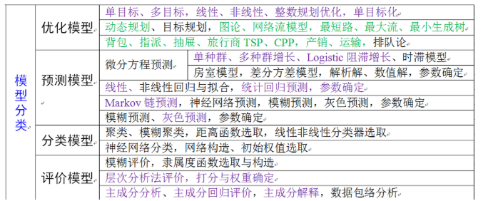

[TOC]

> 本人已参加过不下十次建模比赛，拿过大大小小的奖项，遂将一些建模经验分享出来，造福学弟学妹。（下面的经验没有按照什么特定的顺序，想到就写，有些是摘抄知乎上数学建模大神的经验）

## 1. 论文结构不能缺
* 摘要
* 问题重述
* 问题分析
* 模型假设
* 符号说明
* 模型的建立与求解
* 模型的评价
* 模型的改进与推广
* 参考文献
* 附录

***

## 2. 一篇论文中最重要的几个部分
* 摘要：摘要写的不好，论文直接pass掉。
* 论文的格式和排版
* 所用的模型（创新性）

***

## 3. 关于英文论文写作需要知道的几点（适用于某些需要撰写英文论文的建模比赛，如美赛、数学中国办的小美赛、亚太赛等）
> 英文科技文献的写作，最重要的不是华丽的句子，而是清晰的逻辑，其次是华丽的句子。但是不要刻意追求句式的华丽，应主要采用简单句式，复杂句式适当使用，显得论文更加高端。

* 1、 能用简单句式就不考虑复杂句式
* 2、 不要一味地采用简单句子，让句式错落有致
* 3、 不要采用汉译英的翻译模式

***

## 4. 美赛获得二等奖的秘诀
> 在于“摘要+排版”。
> 可以说“摘要+排版”直接决定了你能否获得美赛二等奖及其以上的奖励，对于一个评委来说，他根本没有太多时间阅读你的论文，通常的做法是看一遍摘要，翻一下你的论文，只要你摘要写得好，排版漂亮，二等奖没有问题。甚至可以这么说，你的摘要和正文没有实质性的关系，摘要写得出色了，拿到二等奖概率也是非常大的，这种情况有现实案例发生了。关于如何排版，我给大家的建议是多看一下美赛特等奖的论文，看上4-5篇，总结一下别人的论文结构以及值得借鉴的地方。

(自我觉得，这一经验适用于几年前的美赛，目前的美赛，单靠“摘要+排版”还是很难获得二等奖，还需要漂亮的图表！抓评委眼球！)

***

## 5. 数学模型基础知识的储备
> 数学建模比赛中，常用的模型可以分为四大类：优化模型、预测模型、分类模型以及评价模型。每类模型下面还有很多小模型，很显然的一个问题是全部掌握这些模型是不可能的，那么怎么办呢？每大类模型下面要熟练掌握2~3个模型（包括原理和源代码），其它模型不需要熟练掌握，但是要熟悉，比赛过程中用到的话，再找资料查。至于算法部分，我认为至少需要掌握几种启发式的算法，比如遗传算法、模拟退火、蚁群算法等等。赛前，准备好这些算法的源代码，一旦用到之后，通过很小的改动即可直接拿来用，既省时又省力。

***

## 6. 美赛和国赛的区别
美赛的论文思路与真正的科研更加接近，而国赛的论文和一些中文的期刊更相似。
### 6.1 模型假设
> 模型的假设在真正的科研过程中是非常重要的，因为它直接决定了你考虑问题的方向。在美赛论文写作中，模型假设部分需要明确写出假设的合理性，这是与国赛论文不同的地方。大家参考优秀的美赛论文，模型假设这一部分就可能写一页以上，而国赛更显得是凑字数的感觉。
### 6.2 模型建立
> 美赛的问题一般比较棘手，同学们在4天时间内，提出非常出色的方案不容易，因此，大家在比赛过程中，应该首先提出一个可行性方案，并且求解该方案，作为一个保底的模型。然后，如果时间充足的情况下，进一步将模型深入化，考虑更多的因素进入模型，一步一步地深化问题。由于美赛问题没有固定的结果，因此，模型求解得到的结果只要是合理就可以了。
### 6.3 结果分析
>   这一点我要特别强调一下，它特别重要。在真正科研过程中，结果分析是非常重要的一环，不可或缺，在美赛中也是如此，详细的结果分析很容易提升论文的档次，这是国际一等奖和国际二等奖的关键区别，甚至可以凭借这一点冲击特等奖。大家阅读美赛特等奖论文的时候，要特别留意一下别人的结果分析是怎么做的，进而总结一下，用到自己的比赛中。 经常提到的灵敏度分析和稳定性分析，都是结果分析中的一个部分，参赛队务必重视这一点。

***

## 7. 美赛论文写作字体要求
* 标题：Arial Unicode Ms 14
* 次标题：Arial Unicode Ms 12
* 摘要关键字：Arial Unicode Ms 12
* 正文: Times New Roman 12

***

## 8. 数学建模参考的书目
* 《数学模型》姜启源等著 阅读人群：建模
* 《数学建模算法与应用》司守奎等 阅读人群：建模、编程
* 《MATLAB 在数学建模中的应用》卓金武等著 阅读人群：编程
* 《MATLAB R2016a 完全自学一本通》刘浩等著 阅读人群：编程
* 《正确写作美国大学生数学建模竞赛论文》&《美国大学生数学建模竞赛题解析与研究》 王杰等著 阅读人群：建模 写作
* 《MATLAB 神经网络 43 个案例分析》 王小川等著 阅读人群：编程

***

## 9. 备份的重要性
“论文手”写论文的时候，一定要注意经常保存备份! 以防万一！

***

## 10. 谷歌搜索指令（频率最高的几条）
* 查找关键字 site:csdn.net
* 查找关键字 filetype:xls
* intitle:查找关键字
* 查找关键字.pdf
***

## 11. 美赛六道题目
* MCM
 A:连续型
 B:离散型
 C:数据分析

* ICM
D 运筹学/网络科学
E 环境科学
F 政策研究
***

## 12. 国内建模比赛的一般评奖标准
国内数学建模竞赛的评奖主要从以下四个方面综合考虑：
* 假设的合理性
* 建模的创造性
* 结果的正确性
* 文字表述的清晰程度

***

## 13. 三人组队原则
* 一个会用数学语言吹各种牛逼的人；
* 一个脑子特别活，不管出什么题都能在网上找到类似题目的人；
* 一个会包装论文，能快速修改论文的人。

***

## 14. 常用预测模型及使用场景

